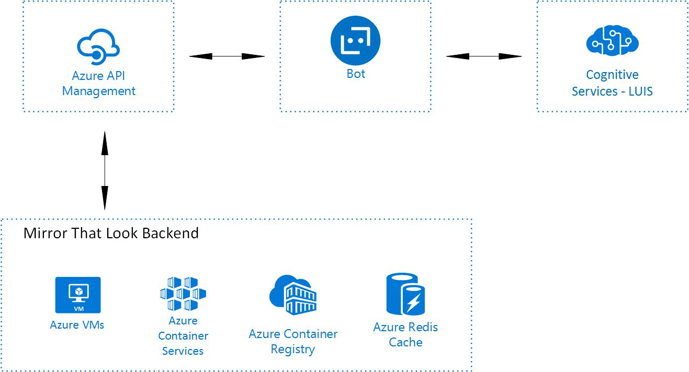

Mirror That Look's technology does visual search for fashion items based on look, price, and retailers. Interacting with this technology through a bot can be more engaging to their users and allow a bot to be seen as a shopping assistant. Building a bot across various chat platforms can also be a taxing process for a small team. This project focused on using the Microsoft Bot Framework and LUIS to build a chat bot that exposes Mirror That Look's visual search technology to more customers and also reduce development time and maintenance.

# Solution overview

In this project, Mirror That Look builds a shopping assistant bot that can reach customers on multiple chatting platforms. The bot can do the following:

- Chat with user and guide them through sending an image and finding similar fashion items
- Allow users to change their search settings, including price range, gender, and retailers

- Key technologies used
	- [Language Understanding Intelligent Service](https://www.luis.ai/)
	- [Microsoft Node.js Bot Framework](https://dev.botframework.com/)
	- [Azure API Managemnet](https://azure.microsoft.com/en-us/services/api-management/)
	- [Azure Bot Service](https://azure.microsoft.com/en-us/services/bot-service/)
	- [Mirror That Look API] (https://developer.mirrorthatlook.com/)
  
## Core Team:
- Surat Teerapittayanon – CTO/Co-Founder, Mirror That Look
- Martin Schray ([@mschray](https://twitter.com/mschray)) – Senior Technical Evangelist, Microsoft 
- Kwadwo Nyarko ([@KJNyarko](https://twitter.com/KJNyarko)) - Technical Evangelist, Microsoft 

## Customer profile ##

[](https://www.mirrorthatlook.com/)

[**Mirror That Look**](https://www.mirrorthatlook.com/) - https://www.mirrorthatlook.com/

Mirror That Look is a startup providing inspiration and helping people discover fashion items through images found on social media and the web or photos taken on the street or in store. The company is building a powerful AI-backed visual search technology for visual-oriented products. They are making shopping more convenient and easily accessible by helping customers get real time shop-the-look results with the ability to compare prices across brands and retailers.

Mirror That Look core product is it's visual search engine, which powers a chrome plugin and now powers a bot.

Mirror That Look is based in New York, NY.  

## Problem statement ##
Mirror That Look is helping people find the fashion items they want and make the best choices across brands and retailers. Often, consumers are on various sites and social platforms when they come across a fashion item of interest. Mirror That Look needs to be able to meet the customer wherever they are, whether it’s on Instagram, Facebook, Pinterest, or a shopping website. The company has a chrome extension for those who are shopping on a computer, but they need to reach more people on various platforms and through various modes of engagement. To that extent, Mirror That Look wants a Facebook messenger bot that allows people to search, discover, and buy fashion items through user provided images. However there are many more platforms outside of Facebook messenger where the company wants to deliver a shopping experience through images and conversation. 

## Challenge ##
Mirror That look wanted to build a Facebook messenger bot but also wanted to be able to easily build bots for other platforms as well. As a small startup, they would incur a high resource cost in building bots across various chatting platfroms, on top of the learning curve across channels. Mirror That Look selected the Microsoft Bot Framework to use in building their bot because of the flexibility it offers and it's integration with multiple chatting platfroms. Moreover the framework allows them to code once and maintain only one code base for their bot, making sure the bot experience across channels is consistent.

## Solution and steps ##
Mirror That Look will have bot across various chat platforms. To start, a priority was given to getting a bot up on Facebook Messenger. The solution has four components. The first component was training a LUIS model. The second component was building the bot using the Bot Framework. The third component was having the visual search functionality exposed through an API, relying on Azure API Management. The fourth component was deploying the bot using Microsoft Bot Service.



Mirror That Look had never used Microsoft's Bot Framework before this project.

Following are the technical details for:
- Training a LUIS model
- Creating a bot using the Bot Framework
- Deploying the bot on Azure Bot Service and Facebook Messenger

### Training a LUIS model ###

Before we started training the LUIS model. We had to know what we wanted the bot to be able to do, and also think about how users would naturally want to interact wtih the bot. This meant that we had to reach a balance between guiding the user and letting users interact with the bot in the same way they would naturally interact with a human shopping assistant. 
The key things the bot needed to understand are when a user is trying to:
- Search for a new style
- Get the current gender they are searching for or update the gender
- Get the current price range or update the price range
- Help the user when they get stuck and navigate

Once we knew what the bot needed to be able to do along with understanding how a user might naturally interact with it, it was relatively straight forward to break that down into intents, entities, and utterances. LUIS makes this very easy. We added the entities first, and then added intents in addition with utterances. The image below is a screen shot showing how to add an intent and an utterance or training data for the intent.

- 
- 

### Creating a bot using the Bot Framework ###

We built the bot using the Node.js version of the Bot Framework, which is added to the project by installing and requiring botbuilder. Moreover because we are going to deploy the bot using the Microsoft Bot Service, we also have to install and require botbuilder-auzre.
```javascript
var builder = require("botbuilder");
var botbuilder_azure = require("botbuilder-azure");
```

In development, we want to use the botbuilder's chatconnector when running on the emulator, and in production, we want to use botbuilder-azure's bot service connector if we are deploying to Azure Bot Service.
```javascript
var connector = useEmulator ? new builder.ChatConnector({gzipData: true}) : new botbuilder_azure.BotServiceConnector({
    appId: process.env['MicrosoftAppId'],
    appPassword: process.env['MicrosoftAppPassword'],
    gzipData: true
});
```

Notice that the gzipData field is set to true. This is done for a few reasons. The bot maintains user data in session.UserData and session.privateConversationData. When we make calls to Mirror That Look's API, the returned json is very large. Setting gzipData ensures that userData, privateConversationData, and conversationData will be gzipped prior to writing to storage. 

Next, in order for out bot to be able to leverage the trained LUIS model in conversation, we have to make sure it's added as a recognizer for the bot.

```javascript
var bot = new builder.UniversalBot(connector);
var luisAppId = process.env.LuisAppId;
var luisAPIKey = process.env.LuisAPIKey;
var luisVersion = process.env.LuisVersion;

var luisAPIHostName = process.env.LuisAPIHostName;
if (!luisAPIHostName) {
    console.log(`Cognitive Service API hostname environment 
        variable'LuisAPIHostName' is not defined`);
    luisAPIHostName = 'eastus2.api.cognitive.microsoft.com';
}

const LuisModelUrl = `https://${luisAPIHostName}${luisVersion}/application?id=${luisAppId}&subscription-key=${luisAPIKey}`;

var recognizer = new builder.LuisRecognizer(LuisModelUrl);
bot.recognizer(recognizer);
```

With the setup out of the way, we can focus on building out the dialogs for out bot. We also build out utility functions to make it easier to manipulate the json returned from Mirror That Look's api. For instance, the returned json is an object containing a list of products in a products field. What we want to show the user when they search, is a list of similar products, 10 at a time, in a carousel of herocards. To that end we have a helper functions that take in products, creates her cards out of them, and builds a carousel message.

Here we use an image resize sevice from cloudinary.com to resize the image to 500px width and 260px height fit within the image area of a herocard.

```javascript
const CLOUDINARY_ID = process.env.CLOUDINARY_ID;
function createHeroCardFromProduct (session, builder, productInfo) {
    let title = productInfo.name;
    let price = productInfo.price;
    let salePrice = productInfo.salePrice || "--";
    let retailer = productInfo.retailer;
    let description = productInfo.description;
    let url = productInfo.clickUrl;
    let imageUrl = `http://res.cloudinary.com/${CLOUDINARY_ID}/image/fetch/w_500,h_260,c_pad/${productInfo.image}`;
    let subtitle = `${productInfo.retailer}, $${price}`

    return new builder.HeroCard(session)
        .title(title)
        .subtitle(subtitle)
        .text(description)
        .images([
            builder.CardImage.create(session, imageUrl)
        ])
        .buttons([
            builder.CardAction.openUrl(session, url)
        ]);
};

function createCarouselFromProducts (session, builder, products){
    let cards = products.map(product => {
       return herocard.createHeroCardFromProduct(session, builder, product)
    });

    let carouselMessage = new builder.Message(session)
        .attachmentLayout(builder.AttachmentLayout.carousel)
        .attachments(cards);

    return carouselMessage;
};
```

The bot has dialogs that are triggered when an intent matches. Some of the dialogs are not triggered through an intent, but are intemediary dialouges that are started from within other dialouges. The code below illustrates a dialouge that is triggered when the bot recognizes the 'Greet' intent. We can trigger dialouges using triggerAction by passing in the name of the matching intent or by using regular expressions.

```javascript
bot.dialog('Greet', [
    function (session, args, next) {
        // Get user's name if we don't have it
        if (!session.userData.username) {
            session.userData.username = session.message.address.user.name;
        }
        session.endDialog(`Hi ${session.userData.username}! ${utils.phrases.GREETING}`);
    }
]).triggerAction({
    matches: 'Greet'
});
```

In building the bot, we wanted to make sure that we are minimizing calls to Mirror That Looks API. We make a call whenever a new image is sent, otherwise we store the returned json from the previous call. The returned json is an object that has products categorized by the clothing types i.e. tops, bottoms, dresses, etc. The bot diplays results to the user based on clothing type. Storing the returned result allows the bot to show results for the other clothings types without making another call. The issue however is that there is a 65kb limit on session data. The json being returned from the API was much larger than that. To get around this, the returned json was stripped down to the essentials before storing it in the session's privateConversationData.

```javascript
function mtlmirrorthatlook (base_url, imageUrl, gender, optionals, api_key) {
    let fullURL = `${base_url}image=${encodeURIComponent(imageUrl)}&gender=${gender}`;
    if (Object.keys(optionals).length) {
        let optionString ='';
        for (opt in optionals) {
          optionString = `${optionString}&${opt}=${optionals[opt]}`;
        }
        fullURL += optionString;
    }
    let options = {
        uri: fullURL,
        headers: {
            'Ocp-Apim-Subscription-Key': api_key
        },
        json: true
    };
    return request(options)
    .then(function(mtlFullJson) {
      // Only extract basic info from products
      let clothingTypes = Object.keys(mtlFullJson.result);
      let basicInfoJson = {};
      for (let ctype of clothingTypes) {
        basicInfoJson[ctype] = mtlFullJson
          .result[ctype]['products'].map(function(product) {
            basicProduct = {};
            basicProduct.name = product.name;
            basicProduct.price = product.price;
            basicProduct.salePrice = product.salePrice;
            basicProduct.retailer = product.retailer;
            basicProduct.description = product.description;
            basicProduct.clickUrl = product.clickUrl;
            basicProduct.image = product.images[0];
            return basicProduct;
          });
      }
      return basicInfoJson;
    });
};
```

### Deploying the bot on Azure Bot Service and Facebook Messenger ###
We started the project by using the Azure Portal to create a Bot Service deployment. We downloaded the project onto our local development machines and then push to a git repository. Since the Azure Bot service sits on top of the Azure App Service infrastructure, setting up continuous integration was straight forward. With this approach, the bot was deployed from the very beginning of the project.

The image below show how to naviagate the Bot Service settings to turn on continuous integration.

- 
- 
- 

Adding Facebook Messenger channel to the Microsoft bot Framework is a breeze. In Add a channel section of the Bot Framework, select Facebook Messenger. All you need to do is input Facebook Page ID, Facebook App ID, Facebook App Secret and Page Access Token. Just follow [this instruction](https://docs.microsoft.com/en-us/bot-framework/channel-connect-facebook) which is also linked on the set up page. Once that is done. You are all set! Your bot is now on Facebook Messenger.

## Conclusion ##
This project did two things for Mirror That Look. First, the team learned how to develop with the Microsoft bot Framework. Using the framework allows the team to increase their bot development speed across multiple channels, which translates to weeks of saved development time. Second, Mirror That Look now has a bot that their users on Facebook Messenger can use when they are shopping. The team will also be turning on the channels for Slack, Skype and Microsoft Teams soon. 

General Lessons:
- On a small development team, using frameworks that consolidate work and code increases development speed tremendously
- Bot design is not about showing the user all their options. It is about engaging with users in a natural way yet providing just the right amount of information.
- Integrations with LUIS is very easy. It makes your bot way smarter. It is an essential component of a modern-day bot. We are generally impressed with what the bot framework has to offer.

Suggestions:
- Developing with the bot framework's emulator is extremly helpful. A step further would be to be able to have the emulator's UI mock the UI of specific channels. We'd often have to deploy into production in order to see what things look like on Facebook Messenger.
- Links to attachments (images, videos, etc.) on the bot framework's emulator is local and cannot be sent to external server to download and further process the attachments. This makes it harder to test use cases like this on the bot framework's emulator. 

## Additional resources ##
- [Mirror That Look](https://www.mirrorthatlook.com/)

- [Mirror That Look API](https://developer.mirrorthatlook.com/)

- [Language Understanding Intelligent Service Overview](https://docs.microsoft.com/en-us/azure/cognitive-services/luis/home)

- [Botframework Overview](https://docs.microsoft.com/en-us/bot-framework/overview-introduction-bot-framework) 

- [Triggering Dialogs in Bot Framework](https://docs.microsoft.com/en-us/bot-framework/nodejs/bot-builder-nodejs-global-handlers)

- [Registering Your Bot](https://dev.botframework.com/)

- [Bot framwork samples](https://docs.microsoft.com/en-us/bot-framework/nodejs/bot-builder-nodejs-samples)

- [Azure Bot Service overivew](https://azure.microsoft.com/en-us/services/bot-service/)